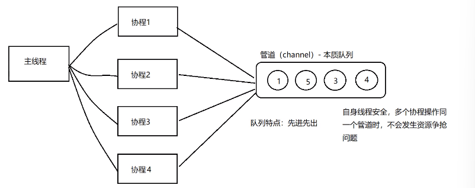

# 管道(channel)特质介绍:
## 1.管道本质就是一个数据结构-队列
## 2.数据是先进先出
## 3.自身线程安全，多协程访问时，不需要加锁，channel 本身就是线程安全的
## 4.管道有类型的，一个string的管道只能存放string 类型数据

# 管道的遍历
## 管道支持 for-range 的方式进行遍历
- 在遍历时，如果管道没有关闭，则会出现 deadlock 错误
- 在遍历时，如果管道已经关闭，则会正常遍历数据，遍历完后，就会退出遍历
## 不能用 for 循环遍历，因为管道底层是队列，没有索引

# select
## 解决多个管道的选择问题，也可以叫做多路复用，可以从多个管道中随机公平地选择一个来执行
- case 后面必须进行的是 io 操作，不能是等值，随机去选择一个 io 操作
- default 防止 select 被阻塞