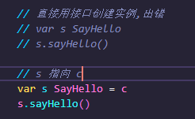
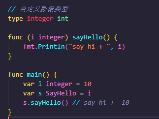

# 接口注意事项
## 1、接口本身不能创建实例，但是可以指向一个实现了该接口的自定义类型的变量
- 见demo01

## 2、只要是自定义数据类型，就可以实现接口，不仅仅是结构体类型
- 见demo02

## 3、一个自定义类型可以实现多个接口
- 见demo03

## 4、一个接口(比如A接口)可以继承多个别的接口(比如B、C接口)，这时如果要实现A接口，也必须将B、C接口的方法也全部实现。
- 见demo04

## 5、interface类型默认是一个指针(引用类型),如果没有对interface初始化就使用，那么会输出nil

## 6、空接口没有任何方法，所以可以理解为所有类型都实现了空接口，也可以理解为我们可以把任何一个变量赋给空接口。
- 见demo05

# 断言
## 什么是断言
Go语言里面有一个语法，可以直接判断是否是该类型的变量:value,ok:=element.(T),这里value就是变量的值，ok是一个bool类型，
element是interface变量，T是断言的类型。
- 见demo06